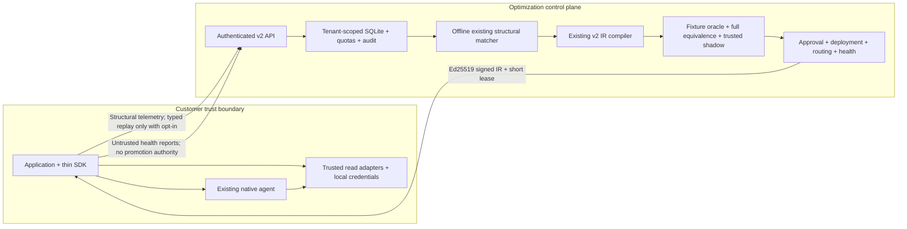

# Approved optimization overlay — implementation report

All seven approved phases are implemented and committed as validation checkpoints. The first
optimization remains the existing read-only `load_customer_context(customerId)` workflow. The v2
matcher/compiler/IR/registry/interpreter are reused. Existing shipping and coding replay paths
remain functional. No financial writes, arbitrary generated code, new model providers, generalized
clustering, graph database, distributed streaming or automatic capability promotion were added.

The implementation is a local integration milestone. It does not establish production connector
correctness, live-agent profitability or production readiness.

The subsequent [real-provider experiment](real-agent-experiment.md) measures live inference on
the same read-only workflow, with full results and explicit limits on billing and production ROI.
The [complete support-agent experiment](support-agent-experiment.md) keeps model-generated
assessment and reply work, comparing a compiled tool with application prefetch. It measures
2.15% and 49.78% total-token savings, respectively, on synthetic records with live inference.
The [routing evaluation](routing-agent-experiment.md) separately tests application-owned task
contracts and direct support-agent fallback, including partial/public tasks, held-out records,
handwritten prefetch and service failures. The original compiler and SDK native fallback remain
available.

## Architecture implemented

1. Explicit observation wraps typed tools and model invocations, recording declared argument
   lineage, timing, failures and provider-reported usage. Unknown usage remains null. Default
   telemetry is structural, without customer values, results, raw messages or private reasoning.
2. Credential configuration establishes tenant/principal/agent identity and role/tool/record
   authorization. Async request identity scopes SQLite records, deployments, settings, effects,
   quotas and audits. The legacy schema migrates atomically into `local-demo`.
3. Offline analysis partitions compatible evidence by tenant, principal, agent, model/provider,
   snapshot, policy, scopes, adapter versions and measurement origin. It uses the existing
   structural matcher. Reports do not alter execution.
4. Eligible patterns create digest-bound draft IR through the existing compiler. Eligibility is
   recomputed from current evidence, and repeated proposals reuse the candidate. Writes and
   successful unsupported work cannot be silently discarded.
5. Validation tests the exact artifact, complete source evidence, adapter contracts, permissions,
   failure cases, full resource values and an independent fixture oracle. C-303 is held out from
   the original sample evidence. Duplicate reads with changed outputs cannot be coalesced.
6. Native-authoritative shadow compares full context and records separate evidence. Current
   validation must have three passing comparisons across the supported fixture domain and no
   divergence. Customer-supplied matches cannot attest readiness.
7. The Node customer SDK contains observation, schemas, constrained execution and deterministic
   routing. Matching, compilation, registry policy and validation stay server-side. Signed
   executable offers bind caller identity and expire within 60 seconds. Live routing requires
   current validation, trusted shadow, approval, deployment and healthy status. Tenant rollout
   defaults to observe/0%.
8. Durable health tracks failure streaks, mismatches, adapter drift and latency regressions.
   Quarantine removes deployment/new offers. Rollback requires a healthy prior approved version
   with current validation/shadow evidence. Revalidation resets health and shadow; hosted
   revalidation removes approval/deployment. Maintenance enforces expiry and tenant retention.

A trusted control-plane runtime callback is needed to establish server shadow evidence. The
standalone server does not invent a native agent or fake successful fallback. Local-demo retains
its manual approval/deployment behavior for compatibility; signed customer offers always enforce
validation plus shadow.

## Phase gates and checkpoints

| Gate                              |  Tests passing | Commit                  |
| --------------------------------- | -------------: | ----------------------- |
| Before implementation             |  74 / 13 files | `8097ba1`               |
| 1: foundations                    |  80 / 15 files | `42701c5`               |
| 2: offline analysis               |  83 / 16 files | `a09d4eb`               |
| 3: candidate connection           |  85 / 17 files | `3e3d9ef`               |
| 4: validation/equivalence         |  89 / 18 files | `bfe5b60`               |
| 5: read-only shadow               |  92 / 19 files | `a8d0824`               |
| 6: SDK/routing                    |  96 / 20 files | `47b097a`               |
| 7: health/rollback/revalidation   | 103 / 22 files | `571fb44`               |
| Final correctness/security review | 107 / 23 files | Final report checkpoint |

Each phase ran the complete existing Vitest suite plus its new tests and lint/type checking before
continuing. Foundational regressions were fixed before the next phase. The final review additionally
covers separate hosted promotion, zero rollout, incomplete usage, changed duplicate outputs,
seven-day run/checkpoint expiry, owner-only SQLite access, and correct health accounting for
expected shadow-native execution.

Final validation uses Node 24.21.0 on macOS arm64. The host's initial Node 25.1.0 also passed, but
Node 24 was used for the retained benchmark and final supported-runtime gate. Commands: `npm run
lint`, `npm run test:all`, `npm run eval`, `npm run build`, `npm run build:sdk`, emitted SDK ESM
import, and `npm run test:e2e`. Both existing browser workflows pass. A Node 24 GitHub Actions
workflow now runs those gates; that remote workflow has not been executed in this session.

## Tests added and strengthened

32 tests were added to the original 74-test suite, plus one further provider-usage regression
(33 additions total). Ten new test files cover:

- `tests/integration/optimization-foundations.test.ts`: tenant overlap and asynchronous identity,
  hosted credentials/roles, failed re-verification, fallback outcomes and privacy/observation.
- `tests/integration/storage-migration.test.ts`: real legacy SQLite migration, deployments/effects,
  settings, foreign keys and reopen behavior.
- `tests/compiler/pattern-analysis.test.ts`: existing matching across wording/order, compatibility
  boundaries, unsupported work and unknown measurements; failed tool attempts count in averages.
- `tests/integration/pattern-candidates.test.ts`: actual observation to draft compilation,
  idempotent proposals, tenant isolation and rechecked eligibility.
- `tests/differential/full-context.test.ts`: wrong identities/lateness despite equal aggregates,
  missing source evidence, false lineage and adapters ignoring cancellation.
- `tests/integration/shadow.test.ts`: native authority, held-out coverage, revalidation reset,
  divergence and unavailable baseline without shadow reads.
- `tests/integration/sdk.test.ts`: private default observation, full routing integration,
  signatures/expiry/identity, outages/permissions/HTTPS, untrusted promotion evidence,
  successful repeated shadows and accurate wrapped/reported model usage.
- `tests/integration/health.test.ts`: quarantine, rollback, latency regression, retention/isolation,
  failed observation metrics and verification/revocation races.
- `tests/runtime/observer-budgets.test.ts`: concurrent attempts cannot bypass observation limits.
- `tests/integration/hosted-lifecycle.test.ts`: separate nonlocal approval/deployment/shadow,
  observe/zero-percent routing, live execution and revalidation removing traffic.

Existing compiler/runtime/API tests were strengthened for duplicate-read values, fractional and
unknown usage averages, and exact-digest verification. Existing shipping/coding tests and both
browser tests remain passing. No timing-savings assertion is used as a correctness gate.

## Security controls added

- Hashed service credentials, role checks, trusted tenant/principal/agent binding and durable
  per-tenant request quotas. Caller tool and customer-record permissions precede either path.
- Composite tenant keys and foreign keys, tenant settings/deployments/effects, safe migration,
  tenant export/deletion and owner-only database/WAL/shared-memory permissions.
- Minimal structural transport and explicit replay opt-in; contract-projected business evidence;
  secret/email redaction; unknown values omitted; depth/size limits; generic hosted error logging.
- Standard Ed25519 signatures, public-key pinning, exact digest checks, tenant/principal binding,
  lease expiry, HTTPS except loopback, redirect rejection and bounded response/network waiting.
- Strict IR/opcode/schema allowlists, actual adapter-scope checks, result identity/snapshot checks,
  bounded tool/model attempts, bounded output collections, runtime deadline and cancellation.
- Complete distinct evidence, explicit value lineage, no privilege expansion, no unsafe pruning,
  independent oracle, full equivalence, trusted shadow, separate hosted promotion and revision
  checks against stale verification.
- Durable health quarantine, safe rollback, current validation and fresh shadow after revalidation.
  Customer reports may conservatively disable only their own optimization, never restore trust.

These controls do not replace infrastructure isolation, production identity integration or real
connector authorization/freshness semantics.

## Measurements and correctness

The retained [raw benchmark](optimization-benchmark.json) was generated by
`scripts/benchmark-optimization.ts` on v24.21.0 (darwin/arm64). It executes the real SDK,
authenticated loopback API, signer and interpreter with fake credentials, ephemeral keys, an
in-memory registry and controlled fixture reads delayed by 8 ms.
There are 30 alternating pairs after three warmup pairs, covering C-101/C-202/C-303. Wall time
includes offer download and telemetry delivery. Analysis, compilation, verification and initial
shadow setup are excluded from steady-state pairs.

The baseline replays the four-read fixture workflow, including a duplicate CRM read. It does not
invoke a live model. Its model/token fields remain unknown for the actual native-agent comparison,
rather than turning a model-free replay into a claim about agent inference cost.

| Metric                            |  Baseline fixture replay | Optimized fixture replay |   Measured saving |
| --------------------------------- | -----------------------: | -----------------------: | ----------------: |
| Mean complete SDK wall time       |                 41.86 ms |                 24.32 ms | 17.54 ms / 41.90% |
| p50 wall time                     |                 41.79 ms |                 24.36 ms |     See raw pairs |
| p95 wall time                     |                 45.48 ms |                 27.04 ms |     See raw pairs |
| Tool calls per run                |                        4 |                        3 |           1 / 25% |
| Optimization API requests per run |                        2 |                        2 |                 0 |
| Model calls                       | Live baseline unmeasured |  0 in compiled execution |           Unknown |
| Input/output/total tokens         | Live baseline unmeasured |  0 in compiled execution |           Unknown |
| Cached input tokens               |               Unmeasured |  0 in compiled execution |           Unknown |
| Cost USD                          |               Unmeasured |               Unmeasured |           Unknown |

All **30/30** pairs match full customer identity, eligibility, tenant/snapshot, order IDs/lateness
and refund IDs/amounts. Only list order is normalized. The lifecycle passed
21 candidate checks and three trusted shadow comparisons. Offline
analysis plus compilation took 5.46 ms and fixture verification
took 108.62 ms in this run; these are setup observations,
not production compiler capacity claims. After quarantine, the SDK used the native callback and
returned a successful sandbox result.

Original imported sample fixtures average 6.5 recorded model calls, 8,480 tokens and 39,000 ms.
Those are explicitly labeled source-fixture values and are **not** compared to these replay times
to calculate token, model-call, latency or cost savings. Production token/model-call/dollar savings
require a paired live-agent run with actual provider usage and equivalent authorization/results.
No benchmark or pricing result is fabricated.

## Fallback behavior

| Condition                                                   | Behavior                                                                                 |
| ----------------------------------------------------------- | ---------------------------------------------------------------------------------------- |
| Observe mode, zero rollout, no eligible offer               | Native agent callback                                                                    |
| API unavailable, bad signature, expired lease               | Guarded native callback; telemetry failure does not fail work                            |
| Optimization guard misses on versions/freshness/input class | Native callback, with recorded reason                                                    |
| Tool/record/tenant/principal authorization denied           | Denied; no native privilege bypass                                                       |
| Compiled read fails or customer unsupported                 | No partial result; checkpoint plus authorized native handoff                             |
| Native callback resolves / fails / remains unresolved       | Accurate success / failed / unresolved outcome                                           |
| No callback configured                                      | Unresolved fallback, never fabricated success                                            |
| Health quarantine or rollback                               | New offers follow eligible active state; in-flight/issued leases are bounded, not erased |
| Revalidation                                                | Fresh validation/shadow/promotion required for hosted live traffic                       |

Read-only fallback may repeat already completed reads. The checkpoint records context and does not
resume the compiled plan or commit external effects.

## Known limitations and work before production

1. Contracts, supported IDs, snapshot and independent oracle remain fixture-specific. Implement
   trusted production read connectors with record authorization, real resource versions/ETags,
   coherent snapshot/re-read semantics, rate limits and provider cancellation. Do not widen the
   domain merely by refreshing `observedAt` or changing a schema string.
2. Run a paired live-agent evaluation on held-out real workloads under sandbox credentials and
   provider-reported usage/pricing. Include tool/API overhead, cache behavior, compilation/shadow
   costs, fallback rate and customer-value correctness. Current replay does not prove economics.
3. Wire a trusted native runtime to server shadow or introduce a reviewed attestation mechanism.
   Customer SDK shadow reports alone are intentionally insufficient for promotion. The standalone
   server has no native callback by default.
4. Add production credential/identity lifecycle (e.g. organizational SSO/service identity), tested
   key rotation/revocation distribution, TLS ingress, secrets management and least-privilege
   deployment. Current service-key rotation needs configuration reload/restart.
5. Deploy encrypted storage and backups, stronger audit retention/access controls, physical deletion
   procedures and operational retention schedules. Row deletion does not erase historical pages,
   WAL copies or backups. Run/checkpoint evidence expires in seven days; audits and artifact
   metadata persist until tenant deletion. Legacy records without expiry remain unless deleted.
6. Schedule maintenance/revalidation and operational alerts. Thresholds are conservative V1
   defaults, not calibrated production SLOs. Remote client-reported metrics are untrusted and can
   cause only same-tenant denial of optimization. Expired evidence can prevent revalidation.
7. Add global admission controls and distributed quotas if scaling beyond the single-process
   SQLite control plane. Analysis has a 10,000-trace budget; there is no streaming miner, durable
   telemetry queue, multi-region registry or automatic repair/promotion.
8. Package/version the private Node SDK for the chosen deployment channel. It currently has no
   browser distribution, durable offline cache or remote immediate cancellation. Offers expire
   within 60 seconds; an already accepted read cannot be undone. Synchronous telemetry and shadow
   add bounded waiting/read load.
9. New control operations are API/CLI based. The existing local UI is preserved; no hosted tenant
   operator interface or new dashboards are provided.

No production deployment, external message or package publication was performed.

## Files changed

Paths are relative to the repository. Generated `dist`, `dist-sdk`, browser screenshots and
Playwright reports remain ignored. `package-lock.json` was unchanged; no new runtime dependency
was introduced.

- `.github/workflows/ci.yml`
- `.gitignore`
- `AGENTS.md`
- `README.md`
- `docs/adr/0002-optimization-overlay.md`
- `docs/customer-sdk.md`
- `docs/implementation-report.md`
- `docs/optimization-benchmark.json`
- `docs/optimization-implementation.md`
- `package.json`
- `scripts/analyze-patterns.ts`
- `scripts/benchmark-optimization.ts`
- `scripts/build-sdk.ts`
- `src/app.ts`
- `src/compiler/analyze.ts`
- `src/compiler/compile-ir.ts`
- `src/compiler/ir.ts`
- `src/compiler/passes/dedupe-reads.ts`
- `src/compiler/passes/prune.ts`
- `src/exploration/observe.ts`
- `src/exploration/privacy.ts`
- `src/exploration/tool-events.ts`
- `src/integration/client.ts`
- `src/integration/protocol.ts`
- `src/registry/jit.ts`
- `src/registry/migrations.ts`
- `src/registry/store.ts`
- `src/runtime/adapters/registry.ts`
- `src/runtime/bounded.ts`
- `src/runtime/checkpoint.ts`
- `src/runtime/dispatcher.ts`
- `src/runtime/interpret.ts`
- `src/runtime/observable.ts`
- `src/runtime/shadow.ts`
- `src/security/identity.ts`
- `src/security/signing.ts`
- `src/server.ts`
- `src/service.ts`
- `src/telemetry/health.ts`
- `src/telemetry/measurement.ts`
- `src/verification/evidence.ts`
- `src/verification/verify-ir.ts`
- `tests/compiler/pattern-analysis.test.ts`
- `tests/compiler/trace-to-ir.test.ts`
- `tests/differential/full-context.test.ts`
- `tests/integration/health.test.ts`
- `tests/integration/hosted-lifecycle.test.ts`
- `tests/integration/jit-flow.test.ts`
- `tests/integration/optimization-foundations.test.ts`
- `tests/integration/pattern-candidates.test.ts`
- `tests/integration/sdk.test.ts`
- `tests/integration/shadow.test.ts`
- `tests/integration/storage-migration.test.ts`
- `tests/runtime/dispatcher.test.ts`
- `tests/runtime/observer-budgets.test.ts`
- `tsconfig.sdk.json`
